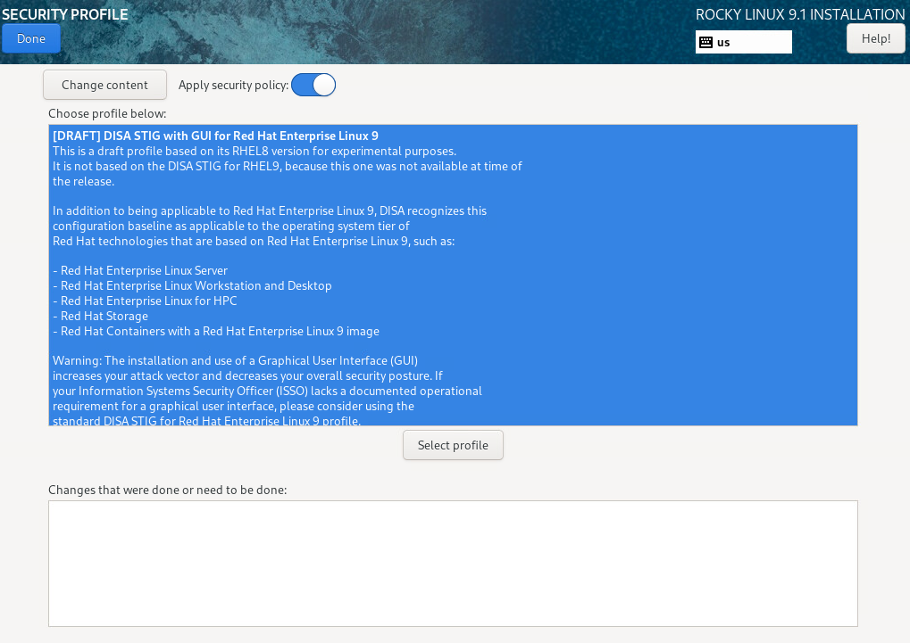
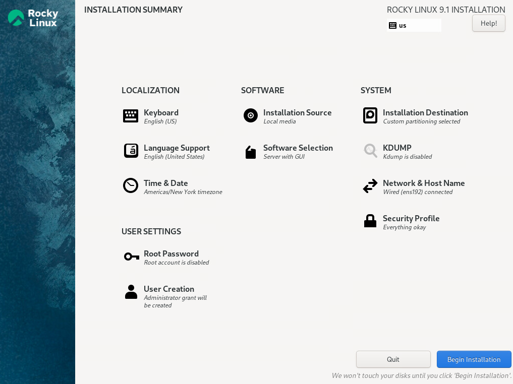
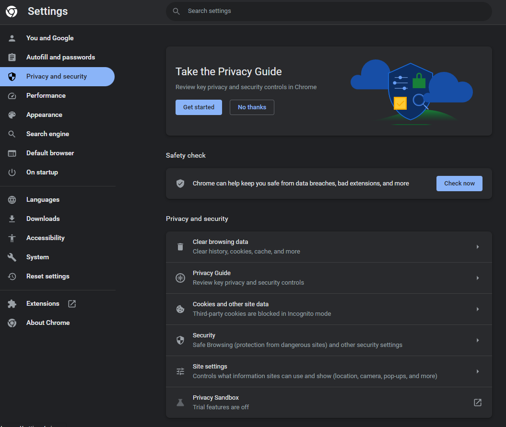
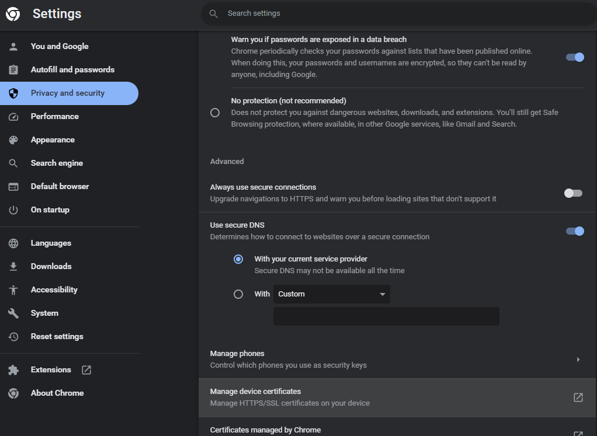
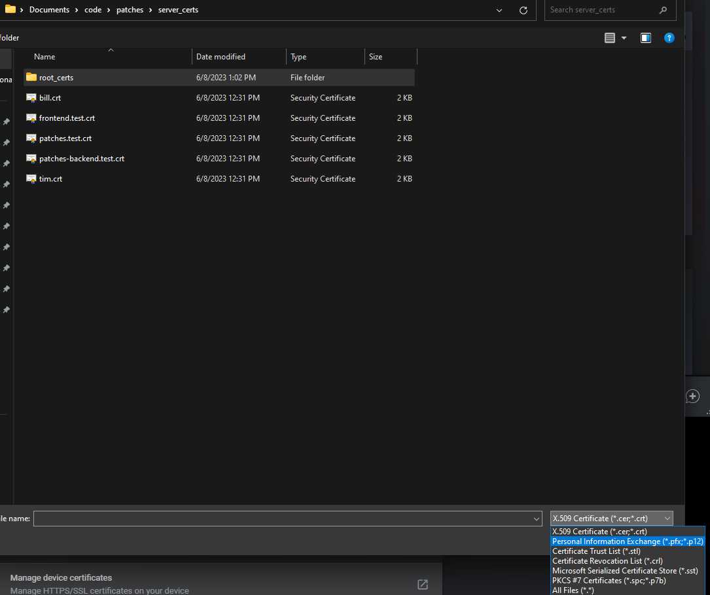
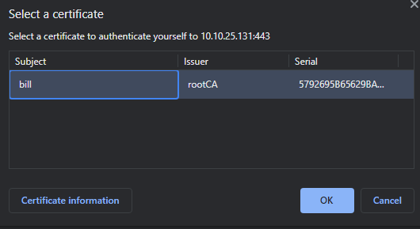
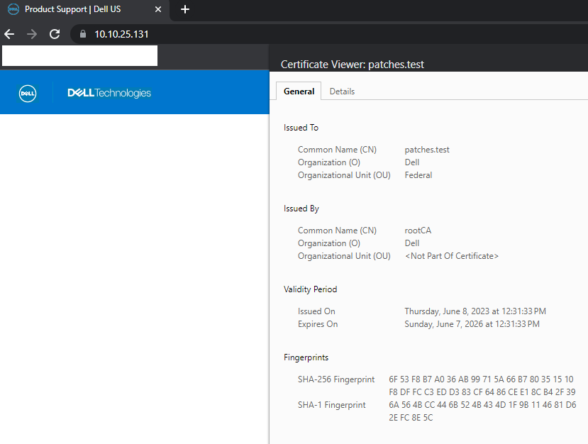
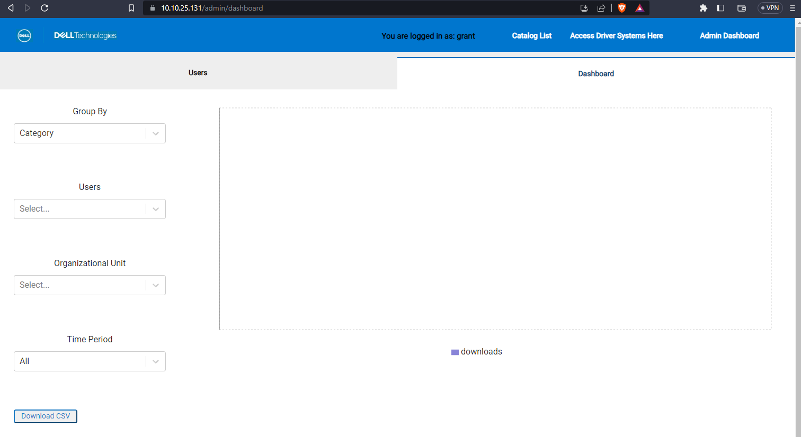
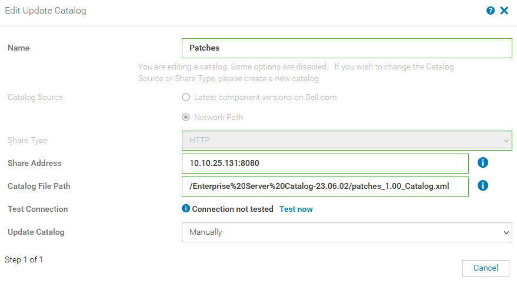

# Patches

- [Patches](#patches)
  - [Beta](#beta)
  - [Quick Start](#quick-start)
  - [What Is Patches?](#what-is-patches)
  - [Supported Operating Systems](#supported-operating-systems)
    - [What is Rocky Linux and Where Can I Get It](#what-is-rocky-linux-and-where-can-i-get-it)
    - [STIGs](#stigs)
      - [How to Apply](#how-to-apply)
  - [System Requirements](#system-requirements)
  - [Our Stance on Security](#our-stance-on-security)
  - [System Requirements](#system-requirements-1)
  - [Patches Architecture Overview](#patches-architecture-overview)
  - [The Easy Installation](#the-easy-installation)
  - [The Long and Manual Installation](#the-long-and-manual-installation)
    - [Install Podman](#install-podman)
    - [Open Ports](#open-ports)
  - [Before You Run Setup](#before-you-run-setup)
    - [Integrating Into Existing PKI Infrastructure](#integrating-into-existing-pki-infrastructure)
      - [Import Keys](#import-keys)
      - [Manually Importing Root CA Certificates](#manually-importing-root-ca-certificates)
    - [Customizing Setup](#customizing-setup)
      - [Users](#users)
  - [Running Setup](#running-setup)
    - [Manually Importing Repositories](#manually-importing-repositories)
    - [Setting Up Certs](#setting-up-certs)
  - [Admin Panel](#admin-panel)
  - [OpenManage Enterprise (OME)](#openmanage-enterprise-ome)
  - [How to Pull New Patches](#how-to-pull-new-patches)
  - [How We Version](#how-we-version)
    - [Major Version](#major-version)
    - [Minor Version](#minor-version)
    - [Patch Version](#patch-version)
  - [Debugging](#debugging)

## Beta

Patches is currently in beta. The main branch will have the latest build but you may encounter bugs or problems. Please report them in the issue tracker.

## Quick Start

Jump down to [The Easy Installation](#the-easy-installation) and copy the commands! Skip the rest!

## What Is Patches?

Patches is a container-based, offline repository with a web frontend that hosts all of Dell's PowerEdge patches. What it gives you:

- The ability to host all PowerEdge patches with a GUI in a totally offline environment
- Automatically deploys httpd and hosts all repositories for easy integration with [Open Manage Enterprise (OME)](https://www.dell.com/support/kbdoc/en-us/000175879/support-for-openmanage-enterprise#OME-Download)
- Provides search functionality for patches
- Provides a web-GUI for tracking patch download statistics
- Provides a certificate-driven authentication system to meet compliance requirements (works with CACs)
  - Provides provisions for importing certs from your own PKI infrastructure
- Runs on a fully STIG-compliant platform (see [STIGs](#stigs) and [Our Stance on Security](#our-stance-on-security))
- Setup is fully automated

**Beta**: In the full release we will add the ability to disable cert checking but for the beta it is force enabled. Patches is primarily designed to integrate into an existing PKI infrastructure.

## Supported Operating Systems

Patches can be run on any *nix system that supports `podman` but all testing was done on and the instructions written for [Rocky Linux](https://rockylinux.org/) and we strongly suggest this be the operating system of choice for Patches.

We have tested on Rocky Linux 9.2.

Any RHEL-based system should work out of the box. Please post an issue if you encounter issues.

### What is Rocky Linux and Where Can I Get It

Rocky Linux is the spiritual successor to previous iterations of CentOS. It is available [here](https://rockylinux.org/).

We recommend you use the Minimal distribution.

### STIGs

If you need to apply [STIGs](https://public.cyber.mil/stigs/) for your organization Rocky Linux comes with an option in the installer to automatically STIG the operating system. See [this official Rocky Linux guide](https://docs.rockylinux.org/books/disa_stig/disa_stig_part1/) for how to create a STIG-hardened Rocky instance automatically.

**Note** At the time of writing the docs only mention Rocky Linux 8 but it is available for Rocky Linux 9 as well.

#### How to Apply

1. During the Rocky installation process you will reach the installation splash screen. 
2. **Warning** you will have to create custom partitions to comply with the STIGs as seen below:


3. Click security profile:


4. Select DISA STIG with GUI for Red Hat Enterprise 9. You can also select the non-GUI version.
   1. Note: The STIGs for RHEL 9 are in draft at time of writing. If you need STIGs that are not in draft you can use Rocky Linux 8.



5. If you have done everything correctly the Security Profile should say "Everything Okay"



## System Requirements

These are the minimums
 
- 1 core
- 8 GBs of RAM
- At least 80 GBs of free space on the partition you install to (this will be checked during installation)

## Our Stance on Security

After initial setup nothing in Patches runs as sudo. Everything runs as user and in fact, if desired, you can run the entire installation as user without ever elevating to sudo. This includes the podman instance that powers Patches.

## System Requirements

Patches can run on a shoestring server, but the installer will check to make sure you have at least 80GBs of free space during the installation. Note: This is not to say that the hard drive should be 80GBs, there must be 80GBs of free space at runtime.

## Patches Architecture Overview

It is not important that you understand this to use Patches, but it is provided here for those who want to understand a bit behind how it works without reading the code. Patches consists of the following Podman containers:

- A NodeJS backend for handling all queries. Anytime Patches has to process requests for a specific patch, look up admin data, etc, NodeJS does the processing.
- A ReactJS frontend for displaying the frontend. ReactJS is a JavaScript framework for building web interfaces.
- An instance of Nginx which proxies connections from users to either the ReactJS frontend server or the backend server dependent on the URI requested. When you connect to Patches you first connect to Nginx. Nginx then determines what you are asking for specifically and forwards it to either ReactJS or NodeJS.
- Postgresql stores all metadata for the various patches along with the user statistics of who used what Patches
- An HTTPD container which hosts the raw Dell Repository Manager repos which OME can leverage

## The Easy Installation

If you are on RHEL-family systems, including Rocky, you can copy and paste this code into your terminal to run the Patches and skip right to the section [Before You Run Setup](#before-you-run-setup):

**If your system is STIG'd, you need to paste each command separately!**

```
sudo wget https://raw.githubusercontent.com/dell/patches/main/bootstrap.sh
sudo chown $(logname):$(id -gn $(logname)) ./bootstrap.sh
sudo bash ./bootstrap.sh
```

## The Long and Manual Installation

1. Go to [the Patches releases](https://github.com/dell/patches/releases)
2. Download the source code under Assets at the bottom of the page.
3. Extract the zip/tar to a location of your choosing. Patches will install to this location so make sure it is in the desired install location.
4. If your Linux instance does not have a web UI you can use [WinSCP](https://winscp.net/eng/index.php) to upload the files from your desktop to the Linux server. Linux desktops also have a [built in SCP client](https://www.geeksforgeeks.org/scp-command-in-linux-with-examples/)
5. After you place the files on your Linux server make sure they are owned by you with `sudo chown -R $(whoami) /path/to/patches`

### Install Podman

Run `sudo dnf update -y && sudo dnf install -y podman` and then reboot with `sudo reboot`. The reboot just makes avoiding permissions / kernel issues easy because that information is reread on boot.

Run `podman run hello-world` as your user to test your privileges. If this does not run correctly, Patches will not run correctly.

**WARNING**: If you are SSH'ing to your server, make sure you ssh as a user and **not** root. If you SSH as root and then `su` to user, podman will issue `ERRO[0000] XDG_RUNTIME_DIR directory "/run/user/0" is not owned by the current user`. This happens because the user that originally setup `/run` is root rather than your user.

### Open Ports

At a minimum port 443 and 8080 must be open on the server. We recommend opening 80 and 443 so that users who inadvertently go to 80 are redirected automatically to 443. On Rocky Linux/RHEL this is done with `sudo firewall-cmd --zone=public --add-port=80/tcp --add-port=443/tcp --add-port=8080/tcp --permanent && sudo firewall-cmd --reload`

## Before You Run Setup

### Integrating Into Existing PKI Infrastructure

**Only applicable if you plan on using your own certificates/keys**

Patches has its own certs that it generates and uses with its own internal PKI infrastructure. Required certs:

Patches accepts certificates in two formats, PEM and PKCS#12.

If you are using PEM, you will need two PEM files. The first must include at least the root CA's certificate. The second must include the certificate and private key for the patches server itself.

Examples of the certificates are in [rootca.pem](./images/rootca.txt) and [patches.pem](./images/patches.txt)

If you are using PKCS#12, you only need the PKCS#12 file including both the server cert and its certificate chain.

#### Import Keys

To import keys, change to the `patches/podman-build` directory and run `bash patches.sh import-keys <your_pkcs#12 file>` or `bash patches.sh import-keys <root_ca.pem> <patches_server_cert.pem>`.

#### Manually Importing Root CA Certificates

**This will only work for new root CA certs. If you want to change the PKI infrastructure you must run `bash podman-build/patches generate-certificates` or `bash podman-build/patches import-keys <args>`**

The purpose of this function is that you need to add new root CA certs **AFTER** deploying patches to cover a new user base. It **is not** meant to import certificates on initial install.

1. Make sure your certificates are in PEM format and at least have the root CA public key. You can optionally add the private key.
2. Copy your root CA cert to `./server_certs/root_certs`
3. Run `bash podman-build/patches stop && bash podman-build/patches start` to restart the service

### Customizing Setup

The file [config.yml](./podman-build/config.yml) controls all installation/setup settings. You can leave the defaults but we recommend you browse through the settings.

Anything outside of the Developer Options are meant for user configuration.

#### Users

If you **are not** using your own certificates, Patches provides a built in Certificate Authority (CA) which allows users to generate their own user certificates. The certificate properties are enumerated in the section clients of [config.yml](./podman-build/config.yml). If you are not using an existing CA, you will need to update these fields with your user data.

One of these users should have a name that matches the name selected for PATCHES_ADMINISTRATOR.

## Running Setup

Log into your Linux server and browse to the `patches/podman-build` directory. Run `bash patches.sh setup` and follow the onscreen prompts.

It's that simple. After the setup completes patches will be up, running, and available.

### Manually Importing Repositories

**Patches will automatically pull and build the entire PowerEdge catalog. If this is what you need then this is not necessary.**

If you need to pull specific patches there are detailed instructions for manually pulling repositories located at [Download Repositories with Dell Repository Manager](./MANUALLY_PULL_REPOS.md)

If you already have downloaded and exported the repository, run `bash <your_patches_directory>/podman-build/patches.sh import-repository` to import a new repo. Follow the prompts to import the repo.

### Setting Up Certs

If you used Patches to generate user certificates, you will need to download the correct certs and add them to your browser to connect to Patches.

If you used Patches to setup your certs, they will all be in the folder `<your_path_to_patches>/server_certs`.

1. Download the client certs in `<your_path_to_patches>/server_certs` to your desktop. If you are running Windows you can do this with [WinSCP](https://winscp.net/eng/index.php).
2. We have tested with Brave Browser, Chrome, and Firefox. All three use the PKCS#12 format for user certs. Begin by going to your browser settings.


3. Go to Privacy and security (or equivalent depending on the browser). And then click Security.



4. Click Manage device certificates



5. You will need to load two certificates here. The first is the root CA certificate. This is in the `<path_to_patches>/server_certs/root_certs` folder. At the top of the window click Trusted Root Certification Authorities


6. Next click Import. Follow the prompts. For file, select the `root_certs/<your_root_CA>.crt` and add it to your certificate store. You can place it in the default store and say yes when prompted if you are sure.
7. Finally, you want to import the user cert for the user in question. Go to the Personal tab and click import.


8. Import the user's PKCS#12 file (.p12 extension). You will need to change the filetype in the dropdown menu here. Leave the password box empty unless you added a password. You can place the certificates in your personal store.



9.  After you are finished your screen should look like this:


10. Restart your browser. **The new certificates will not load until you have done this!**
11. Next browse to the Patches IP/hostname. You should see a window pop up like this one:



11. If everything has worked up to this point, you should connect to Patches and see that the connection is secure like this:




## Admin Panel

The admin panel is available to the user configured as PATCHES_ADMINISTRATOR. You can also add additional admin users with `bash patches/podman-build/patches.sh add-admin <username>`

To access the admin panel you must be using a cert whose common name matches an administrator. When you do this the "Admin Dashboard" button will appear in the top right of the UI.



## OpenManage Enterprise (OME)

1. Get the OpenManage Enterprise VM from [here](https://www.dell.com/support/kbdoc/en-us/000175879/support-for-openmanage-enterprise#OME-Download)
2. Installation instructions can be found [here](https://www.dell.com/support/home/en-us/product-support/product/dell-openmanage-enterprise/docs)
3. After you have finished installing and deploying OME, go to Configuration->Firmware/Driver Compliance


4. Catalog Management


5. Add the catalog


6. Setup your catalog details and run the test



7. Once you have added the catalog, return to Firmware/Driver Compliance and click Create Baseline. In the popup window select the catalog you just created as the catalog. Follow the prompts to finish adding the baseline.


8. After you add the baseline it will automatically run, but you can also check compliance by clicking the check box next to the baseline and selecting check compliance


## How to Pull New Patches

Run `<your_patches_directory>/podman-build/patches.sh pull-patches`

## How We Version

### Major Version

This is incremented when we make changes that are not compatible with previous versions, such as significant API changes or the introduction of major new features. Updating the MAJOR version indicates that users may need to modify their code or adjust their integrations to work with the new version.

### Minor Version

This is incremented when we add new functionality to the software in a way that is backward-compatible. It signifies the introduction of new features or enhancements that users can take advantage of without needing to make any changes to their existing code or integrations.

### Patch Version

This is incremented when we make bug fixes or address issues in a backward-compatible manner. It indicates that the software has undergone improvements or fixes, ensuring a more stable and reliable experience for users. Updating the PATCH version does not introduce any new features or require modifications to existing code.

## Debugging

See [DEBUGGING.md](./DEBUGGING.md)
